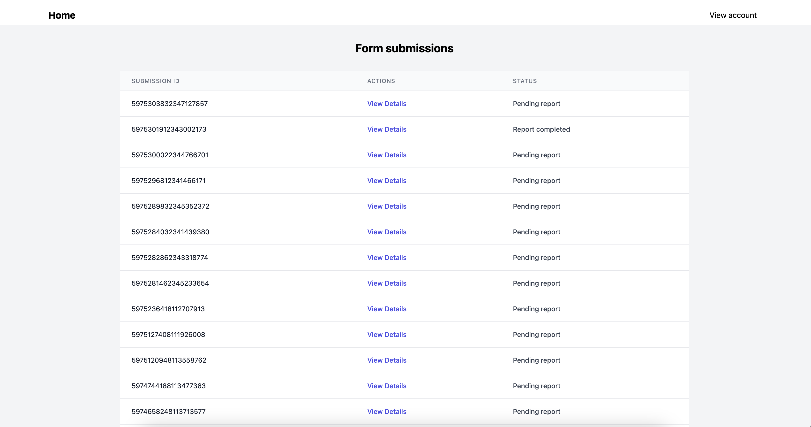

# Multi Tenant Web App with SvelteKit

This is a healthcare platform to demonstrate multi-tenancy with Supabase in a Sveltekit application, with 
the following features:

1. User Authentication and Security:
Implement user authentication with Supabase Auth to ensure only authorized users can access the app, with two groups of users: a person who has signed up to join the platform (member), or the app's administrator.

2. Medical Form Questionnaire:
A member fills out a medical questionnaire within the app. This form include personal information, medical history and other relevant details. It is created with Jotform and embedded on the app's UI.

3. Report Generation:
Based on user inputs, the app allows administrators to view all form submission details and generate reports based on a form submission. These reports could include diagnostic summaries, treatment recommendations and health trends over time. Reports to be presented in various formats (charts, tables, or plain text), to help users understand their health status. *(Currently, it has been simplified to just display their form submission details, instead of a report)*

4. Data Collection and Storage:
Jotform collects and securely stores form responses.
The generated report's data is securely stored in Supabase and can only be accessed by the administrator or the authenticated member.

## User flow

*Login form page. Click on 'Sign up' to create a new user. Supabase is used to authenticate and authorize users.*
These are the following credentials you may use to test a member login. 
Email: user@test.com, Password: securepassword

<br>


*After logging in, the member is redirected to a simple home page with the options to either fill in questionnaire or view their report results*

<br>


*Form is built with Jotform and embedded into the app's interface with iframe. Logged-in member's ID is automatically tagged to the submitted form, so that the form can be easily extracted*

<br>

*After an administrator generates a report based the member's form details, the member will then be able to view the report's content. Currently, this space has been simplified to just display the submission details, instead of a report.*

<br>

## Administrator flow
These are the following credentials you may use to test an administrator login. 
Email: admin1@test.com, Password: securepassword


*After logging in, the administrator is redirected to a page that lists out all Jotform form submissions. Click on 'view details' to view the submission details*

<br>


*Form submission details displayed in a table. Clicking on 'Generate Report' button will run a data processing pipeline to create the report results. Saving the report will ingest it into Supabase. In the future, administrators will also be able to add extra data such as comments.*

<br>

## Developing

Install dependencies with `npm install` (or `pnpm install` or `yarn`), then start a development server:

```bash
npm run dev

# or start the server and open the app in a new browser tab
npm run dev -- --open
```

## Building

To create a production version of your app:

```bash
npm run build
```

You can preview the production build with `npm run preview`.

> To deploy your app, you may need to install an [adapter](https://kit.svelte.dev/docs/adapters) for your target environment.
